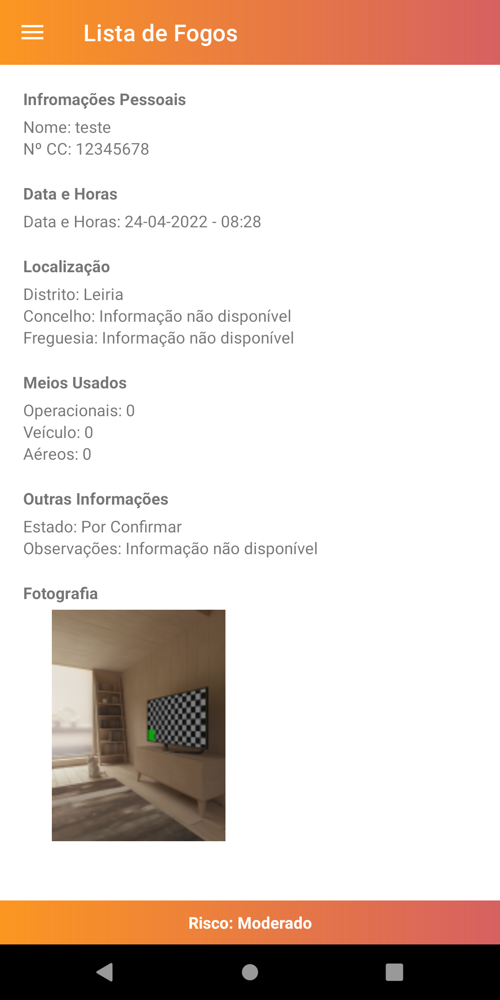

# Projeto Computação Movel - Fogos.pt
<pre>
Filipe Coutinho - a21903016
Tomás Neto - a21903361
</pre>
## Screenshots dos ecrãs

## Funcionalidades

| Critério                                              | Implementado  |Cotação|
| ---------------------------                           |:-------------:| -----:|
| Dashboard                                             | Sim           |   3   |
| Apresentação dos incêndios - Lista                    | Sim           |  2,5  |
| Apresentação dos incêndios - Lista - Rotação          | Sim           |  1,25 |
| Apresentação dos incêndios - Mapa (imagem)            | Sim           |  0,25 |
| Detalhe do incêndio                                   | Sim           |   2   |
| Risco de zona                                         | Sim           |   2   |
| Registo de incêndios                                  | Sim           |  3,5  |
| Suporte multi-idioma                                  | Sim           |  0,5  |
| Navegabilidade                                        | Sim           |   2   |
| Extra                                                 | Não           |   3   |
| Total                                                 | Valor:        |   17  |

## Previsão da nota

17
