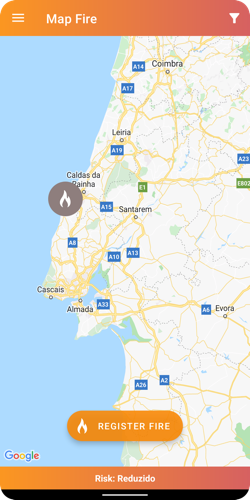

# Projeto Computação Movel - Fogos.pt

<pre>
Filipe Coutinho - a21903016
Tomás Neto - a21903361
</pre>

## Screenshots dos ecrãs

## Funcionalidades

| Critério                                                  | Implementado  |Cotação|
| ---------------------------                               |:-------------:| -----:|
| Dashboard                                                 | Sim           |   2   |
| Filtro por nome do distrito                               | Sim           |   1   |
| Filtro por raio circundante à localização do dispositivo  | Sim           |  1,5  |
| Apresentação dos incêndios - Lista c/ Rotação             | Sim           |  1,5  |
| Apresentação dos incêndios - Mapa (com localização)       | Sim           |  2    |
| Detalhe do incêndio                                       | Sim           |   0,5 |
| Risco de zona                                             | Sim           |   1,5 |
| Registo de incêndios                                      | Sim           |  2    |
| Autonomia                                                 | Sim           |  1    |
| Offline                                                   | Sim           |   3   |
| Extra                                                     | Sim           | 1,5   |
| Vídeo                                                     | Sim           | 2,5   |
| Total                                                     | Valor:        |   18  |

## Previsão da nota
18

## Link Vídeo
[https://youtu.be/3I7gM-ACmuQ]

